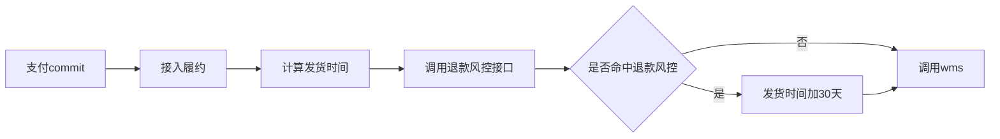
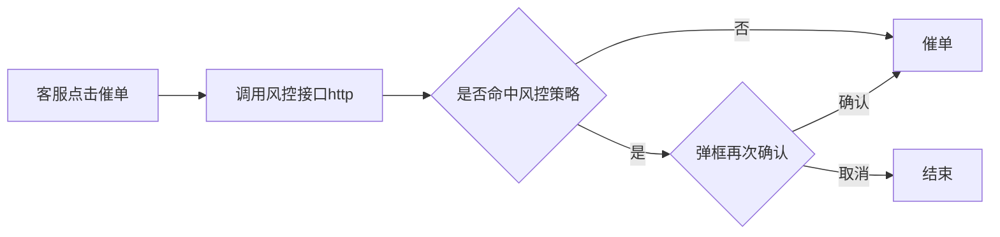

# 三、系统架构

## 3.1 模块

### 3.1.1 特征库

- 多个表

- 读场景
  - 按id查一批子订单维度数据（后台看板）
- 写场景
  - 订单数据更新命令 
  - 物流数据更新命令
  - 历史数据导入脚本
- 存储结构
  - 分表
    - 按存储维度划分，下单、退款同一张表，按子订单维度存储 √
  - 字段
    - userId
    - cuid
    - name
    - phone
    - province
    - city
    - prefecture
    - town
    - address
    - skuId
    - sentAndNotDepositCnt
    - purchaseTime
    - tradeTime
    - refundTime
    - createTime
    - updateTime

- 字段扩展
- 问题思考

### 3.1.2 处罚表

- 一个表

- 读场景

  - 数据展示，后台数据看板做业务分析

- 写场景

  - 命中风控策略

- 存储

```sql
CREATE TABLE `tblPunish` (
  `id` int(10) unsigned NOT NULL AUTO_INCREMENT,
  `punish_key` varchar(20) NOT NULL DEFAULT '',
  `punish_value` varchar(40) NOT NULL DEFAULT '',
  `strategy_id` int(10) unsigned NOT NULL DEFAULT '0',
  `strategy_type` int(10) unsigned NOT NULL DEFAULT '1下单 2退款 3转班',
  `feature_ids` varchar(2000) unsigned NOT NULL DEFAULT '' COMMENT '特征库关联id，下划线拼接',
  `expire_time` int(10) unsigned NOT NULL DEFAULT '0',
  `status` tinyint(4) unsigned NOT NULL DEFAULT '0' COMMENT '0正常 1删除',
  `create_time` int(10) unsigned NOT NULL DEFAULT '0',
  `update_time` int(10) unsigned NOT NULL DEFAULT '0',
  `ext_data` varchar(5000) NOT NULL DEFAULT '' COMMENT '扩展字段',
  PRIMARY KEY (`id`),
  KEY `key_value` (`punish_key`,`punish_value`,`status`)
) ENGINE=InnoDB DEFAULT CHARSET=utf8 COMMENT='处罚表'
```

### 3.1.3 策略

- 对外功能
  - 解析出查询条件
  - 风控检查
- 内部功能
  - 策略存储
  - 策略解析
- 概念
  - 下单、退款、转班分别对应3个strategyType
  - 一个strategyType对应多个strategyId
  - 一个strategyId对应一个策略

### 3.1.4 白名单

- 读场景：按指定字段查询
- 写场景：后台添加
- 存储

```sql
CREATE TABLE `tblWhiteList` (
  `id` int(10) unsigned NOT NULL AUTO_INCREMENT,
  `white_key` varchar(20) NOT NULL DEFAULT '',
  `white_value` varchar(40) NOT NULL DEFAULT '',
  `strategy_type` int(10) unsigned NOT NULL DEFAULT '0',
  `status` tinyint(4) unsigned NOT NULL DEFAULT '0' COMMENT '0正常 1删除',
  `create_time` int(10) unsigned NOT NULL DEFAULT '0',
  `update_time` int(10) unsigned NOT NULL DEFAULT '0',
  `ext_data` var_char(5000) NOT NULL DEFAULT '' COMMENT '扩展字段',
  PRIMARY KEY (`id`),
  KEY `key_value` (`white_key`,`white_value`,`status`,`strategy_type`)
) ENGINE=InnoDB DEFAULT CHARSET=utf8 COMMENT='白名单'
```

## 3.2 核心流程

### 

# 四、接入业务

## 4.1 履约



## 4.2 客服



# 五、todolist

- 策略
  - 退款策略 p0
  - 快速新增策略 p1
  - 策略可配置 p2
- 特征库
  - 提供查询接口 p0
  - 写入接口 p0
    - 接订单更新通知
    - 接物流更新通知
  - 写入脚本 p0
  - 快速新增字段 p1
  - 快速接入新数据源 p1
- 作弊库
  - 后台查询接口p0
- 白名单
  - 读写p1
- 小流量控制 p0